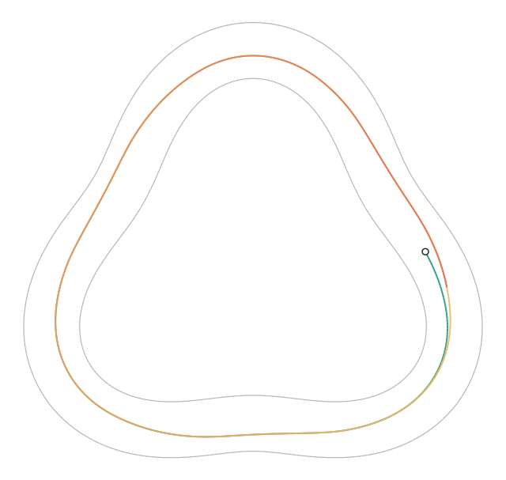
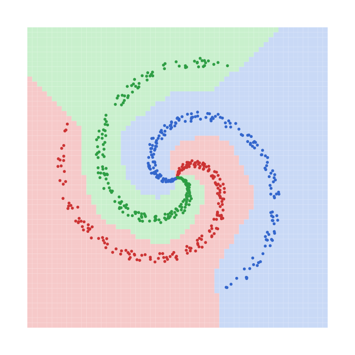
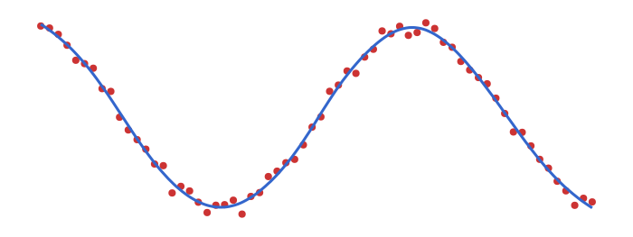
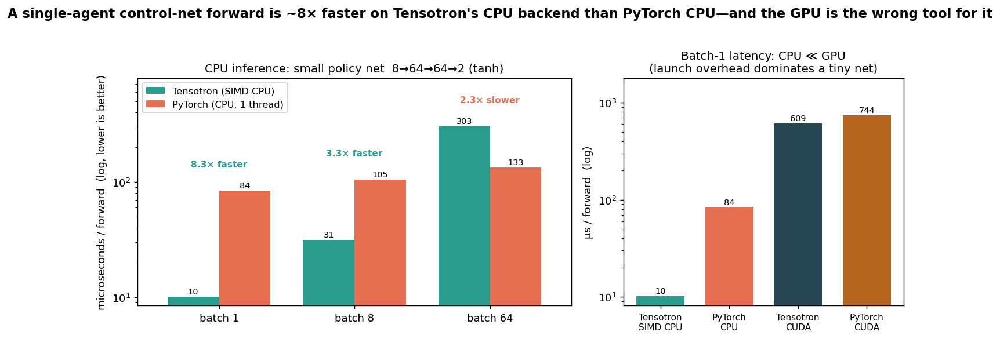
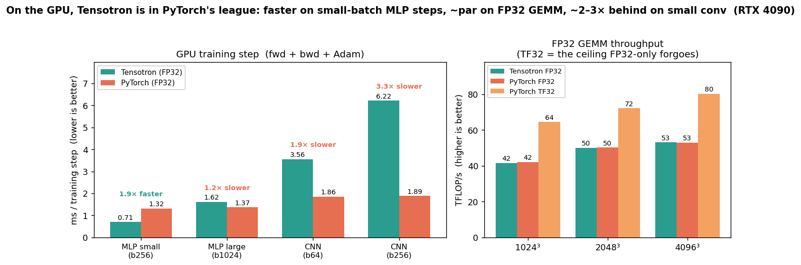
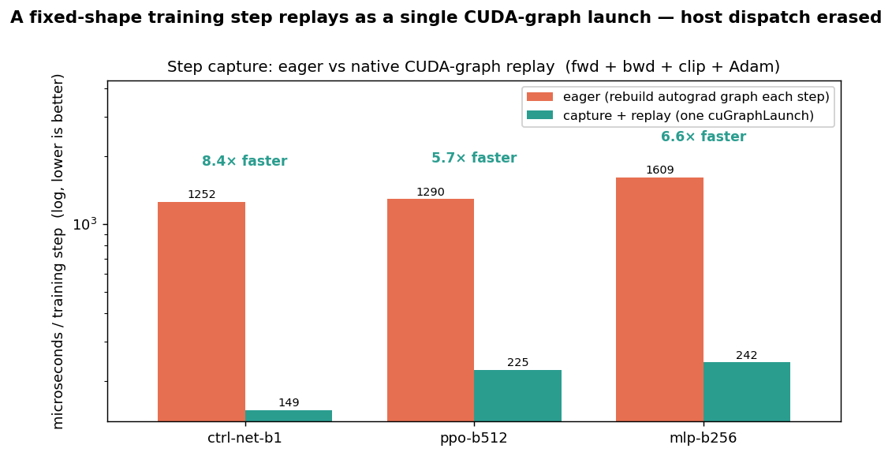

# Tensotron

A **PyTorch-faithful** tensor and autograd library for .NET, **float32** throughout. It runs on **CUDA** (via ILGPU + cuBLAS) when a GPU is present, or a hand-written **managed/SIMD CPU** backend when one isn't — same op surface, same torch-parity tests either way.

<p align="center">

<br><sub><b>A car that taught itself to drive.</b> A continuous-PPO controller — actor, critic, GAE, clipped surrogate, all built on Tensotron — steering around a closed track from five raycast "whisker" distances alone, on a bare +1-per-step-survived reward. Trained from scratch to flawless laps in ~2 minutes <b>on the CPU backend</b>. Everything below is built the same way.</sub>
</p>

> **The law:** for every op it implements, Tensotron matches PyTorch exactly — naming, semantics, broadcasting, gradients (down to behavior at kinks, ties, and special values). If an implemented op doesn't behave like PyTorch, it's a bug. Converting PyTorch code to Tensotron is near-mechanical *within the supported surface* — which is a deliberate subset of torch, not a full reimplementation (see **Scope** below).

> **Scope.** Tensotron targets feed-forward training and inference — MLPs, CNNs, and small RL policy/value nets. **Not implemented** (yet): recurrent layers (RNN/LSTM/GRU), attention / transformer blocks, `Embedding`, `ConvTranspose`, `Conv1d`/`Conv3d`, a dtype system beyond float32, and PyTorch `state_dict`/`safetensors` interop. If your model is sequence- or transformer-shaped, this isn't (yet) the library for it.

## See it learn

Two from-scratch training loops in `examples/` — each a few dozen lines of plain Tensotron — produce these:

<p align="center">

<br><sub><b>Spiral</b> — an MLP separates three interleaved spiral arms. Shaded cells are the learned decision regions; dots are the data, colored by true class.</sub>
</p>

<p align="center">

<br><sub><b>Regression</b> — the same kind of stack fits a noisy sine. Blue is the network output; red dots are the samples.</sub>
</p>

For the reinforcement-learning demo — a PPO controller driving the corridor above — see [`showcase/`](showcase/Tensotron.Showcase) (`CorridorTests`): +1 per surviving step, five whisker sensors, and the track geometry forbids farming reward by circling in place, so it has to actually drive.

## Performance vs PyTorch

**A single-agent control-net forward — the game-AI / RL-inference case — runs ~8× faster on Tensotron's CPU backend than on PyTorch CPU.** A tiny net's cost is per-op dispatch overhead, and Tensotron's managed/SIMD backend has almost none of PyTorch's. PyTorch's tuned GEMM pulls ahead only once the batch is large enough for arithmetic to dominate (~batch 64, shown below — not hidden), and on the GPU a batch-1 forward is *slower* than CPU on **both** libraries: launch overhead, not math. For inference of one agent at a time, the CPU backend is the right tool.



At training scale and on the GPU, Tensotron is in PyTorch's league — it matches PyTorch on FP32 GEMM (both call cuBLAS `Sgemm`), is ~1.9× faster on a small-batch MLP step, roughly par on a large MLP, and trails ~2–3× on conv (per-op host overhead plus cuDNN's fused conv kernels). TF32 tensor cores — an opt-in `AllowTf32` math mode, off by default — are the throughput ceiling on large GEMM, but don't help these overhead-bound small steps.



For the small fixed-shape training steps that dominate small-net RL, capturing the step once and replaying it as a single native CUDA-graph launch erases nearly all the per-step host dispatch — **~6–8× per step** at the control-net / PPO scale where that overhead is the bottleneck (fwd + bwd + grad-clip + Adam, all folded into one `cuGraphLaunch`).



Methodology, full tables, and the *why* are in [`docs/PERFORMANCE_VS_PYTORCH.md`](docs/PERFORMANCE_VS_PYTORCH.md). Reproduce the CPU figure with `dotnet run --project examples/Tensotron.Examples -c Release -- inference` (under `TENSOTRON_BACKEND=simd` then `=cuda`) plus `python tools/bench/torch_infer.py`; the GPU figure with `... -- ladder` plus `python tools/bench/torch_bench.py` on an unloaded GPU; the capture figure with `... -- replay`.

## Backends

One backend runs per process, selected by `Auto` (the default) or the `TENSOTRON_BACKEND` env var:

- **CUDA** (`cuda`) — ILGPU kernels on an async in-order stream, with large matmuls on cuBLAS SGEMM. The stream synchronizes only at host pulls (`ToArray`/`Item`), not per launch.
- **Managed/SIMD CPU** (`simd`) — tensors are `float[]` and every op is a synchronous managed kernel with a `Vector<float>` matmul and no per-op device dispatch. The fast CPU path for small-model inference and training; its matmul has opt-in row parallelism (`TENSOTRON_CPU_THREADS=auto`). At batch-1 it is ~645× faster than the ILGPU scalar CPU accelerator.
- **`Auto`** — CUDA if a GPU is present, otherwise the managed/SIMD CPU backend.

All three pass the same torch-parity suite. The ILGPU *scalar* CPU accelerator (`cpu`) is a correctness-verification reference only — ~600× slower than the managed path at batch-1 — and prints a loud warning when selected.

## Installation

Tensotron is **not yet published to NuGet.** Consume it from source:

- **Project reference** (recommended): clone the repo and reference the library project —
  `<ProjectReference Include="path/to/Tensotron/src/Tensotron/Tensotron.csproj" />`.
- **Local package**: `dotnet pack src/Tensotron/Tensotron.csproj -c Release` produces
  `Tensotron.0.1.0-alpha.nupkg`, which you can add to a local NuGet feed.

Requires .NET 8. A GPU is optional — without CUDA it runs on the managed CPU backend.

## Quick start

```csharp
using Tensotron;

var x = Tensor.FromArray(new[] { 1f, 2f, 3f }, 3).RequireGrad();
var y = (x * x).Sum();   // y = Σ xᵢ²
y.Backward();
// x.Grad == [2, 4, 6]
```

And a complete training loop is the same shape you'd expect from PyTorch:

```csharp
var model = new Sequential(
    new Linear(2, 64), Activation.Relu(),
    new Linear(64, 3));
var opt = new Adam(model.Parameters().ToList(), lr: 1e-2f);

for (int epoch = 0; epoch < 1000; epoch++)
{
    var loss = TensorOps.CrossEntropy(model.Forward(x), labels);
    opt.ZeroGrad();
    loss.Backward();
    opt.Step();
}
```

### Runnable examples

`examples/Tensotron.Examples` is a console app with three from-scratch demos — start here:

```
dotnet run --project examples/Tensotron.Examples            # runs all three
dotnet run --project examples/Tensotron.Examples xor        # smallest training loop
dotnet run --project examples/Tensotron.Examples spiral     # 3-class spiral → spiral.svg
dotnet run --project examples/Tensotron.Examples regression # noisy sine fit → regression.svg
```

No GPU needed (managed/SIMD CPU backend fallback). The spiral and regression demos write an SVG you
can open in a browser. See [examples/README.md](examples/README.md).

## Design

### Define-by-run forward graph

Each result records its `Inputs` and a per-op backward closure as it is computed. The lifecycle is PyTorch-faithful: `NoGrad`, `ZeroGrad`, gradient clipping. `Backward()` clears interior (non-leaf) node grads at entry and accumulates fresh, while leaf grads accumulate across calls — i.e. repeated `backward()` behaves like torch's `retain_graph=True`; call `ZeroGrad` between passes to reset.

Shape/stride is decoupled from storage: reshape/transpose/broadcast are zero-copy stride manipulation (stride-0 marks broadcast dims) — exactly what a strided GPU kernel wants. A host-side broadcaster computes output shapes plus the added/expanded-dimension bookkeeping that drives gradient reduction in backward.

### Autograd: explicit topological sort

Backward sorts the graph topologically, then runs each node's backward closure in reverse order. A node is reached only after every node that consumes its output, so its gradient is already fully accumulated when its closure runs — accumulation is a plain `grad += …`. The order is deterministic and printable.

Each op's backward is a **named-closure node**: `GradNode { string OpName, Tensor[] Inputs, Action<Tensor> Backward }`. Closures stay terse (~1 line per op), and nodes are named so the graph prints and traces are readable.

```csharp
// per op, in the dispatch helper:
result.Node = new GradNode(
    opName: "Add",
    inputs: [a, b],
    backward: g => {
        a.AddGrad(ReduceL(g));   // ReduceL/R handle broadcast reduction
        b.AddGrad(ReduceR(g));
    });

// engine:
var order = TopoSort(loss);
loss.Grad = Ones(loss.Shape);
foreach (var n in order.Reversed())
    n.Backward(n.Grad);          // n.Grad is already fully accumulated
```

### ILGPU hygiene

- One `Context`/`Accelerator`, owned centrally by `IlgpuRuntime` (the ILGPU implementation of the
  abstract `TensorRuntime`; `CpuSimdRuntime` is the managed sibling).
- Kernels compiled once via `LoadAutoGroupedStreamKernel` and **cached in fields/dictionaries** — never recompiled per call.
- Graceful CUDA → CPU fallback, so the suite runs without a GPU.
- Storage is abstracted behind `TensorStorage` (`DeviceStorage` = ILGPU buffer, `HostStorage` =
  `float[]`); the op layer is backend-agnostic and the active runtime downcasts to the storage it owns.

### The hard parts

- **Matmul.** A 2D GEMM core with rank/broadcast/autograd choreography in the portable layer. Handles, PyTorch-style: 1D@1D (dot→scalar), 1D@2D, 2D@1D, 2D@2D, and N-D batched with **broadcast batch dims**; rank promotion then squeeze-back; and backward `dA = dC @ Bᵀ`, `dB = Aᵀ @ dC` **with batch-dim reduction**. Three tiers behind one interface, picked by size: **cuBLAS SGEMM** (`M,N,K ≥ 64` on CUDA — vendor-tuned, matches PyTorch FP32 at scale), a hand-tiled shared-memory ILGPU kernel (the CUDA fallback when cuBLAS doesn't apply), and the naive one-thread-per-output kernel for tiny/skinny products; the managed CPU backend has its own `Vector<float>` matmul. A constant-stride batched matmul above a work threshold issues a single `cublasSgemmStridedBatched` (a direct P/Invoke, since ILGPU's CuBlas binds only single-matrix GEMM); non-constant-stride batches fall back to a per-matrix cuBLAS loop.
- **Elementwise: struct-generic kernels.** ILGPU kernels can't take a `Func<float,float>`, so each op is a `struct IOp { float Apply(...) }` passed as a generic type parameter and inlined at JIT. A single arbitrary-rank strided kernel — global thread id → multi-dim index via the broadcaster's strides (stride-0 = broadcast) — covers every rank with no rank ceiling.
- **Stay on device.** Data is a `MemoryBuffer1D<float>`. Materialize to host **only** on explicit `.ToArray()`/`.Item()`. The eager per-op model (one kernel launch per op, in-place gradient accumulation) is accepted for correctness first; cross-op fusion comes later, behind the same surface.
- **Sync is the enemy, not launch count.** Every op runs on ILGPU's in-order default stream; the stream is drained **only** at host pulls (`ToArray`/`Item`) plus a periodic safety valve (every 64 launches) to bound the in-flight queue. So hundreds of tiny kernels queue async and the device drains them in order. Two things keep the queue cheap to refill: compiled kernels are cached (never recompiled), and the small `dims`/`strides` int buffers — identical every step for a fixed-shape model — are **uploaded once and cached by content** (`_intCache`), not re-uploaded per launch. Cutting launch *count* further (fusing the compounds PyTorch fuses — `addcmul`, bias+activation) is a later step; the optimizer and reductions are already fused/parallel.

### Storage & dtype

- **float32 only.** Matches typical RL/training workloads and keeps the kernel surface small.
- A `Tensor` is `(Shape, MemoryBuffer1D<float>, autograd metadata)`. Shape/strides stay host-side; data stays on device.

### Concurrency

`TensorRuntime` is a **process-wide singleton** and its launch methods share accelerator state without internal serialization. **Tensor execution is single-threaded only** — do not call ops from multiple threads concurrently. (The test suite disables parallelization for this reason.) Internal launch locking is a possible future change.

### Determinism note

GPU reductions via atomics are **not** bitwise-deterministic across runs. PPO-style training tolerates this. If reproducible training is ever needed, use fixed-order tree reductions rather than atomics.

## Grounding in PyTorch

Every op ships with a **golden-fixture parity test or it doesn't land.** A small Python script (`tools/fixtures/gen.py`) emits, per op, `(inputs, forward_output, grads)` from torch into JSON; the C# test asserts **forward and backward** match within tolerance (a `gradcheck` equivalent). torch is needed only to regenerate fixtures — the committed JSON means the C# suite never imports it.

**Fixtures must probe the hard parts, not just the smooth interior.** Random (`randn`) inputs alone are a trap: they never land on a non-differentiable kink (ReLU/LeakyReLU/ELU/clamp at the boundary), never tie (`maximum`/`minimum` with `a == b`), and never hit special values (zero-probability KL targets). Those are exactly where naive implementations diverge from torch. So fixtures additionally include, for any op with a kink, tie, or special value:

- **boundary inputs** that hit the kink exactly (e.g. `x == 0` for activations, `x == bound` for clamp),
- **parameter sweeps** across regimes that break shortcuts (e.g. LeakyReLU slope `< 1`, `> 1`, and `< 0` — a `max(x, slope·x)` shortcut is only correct for `slope < 1`),
- **ties and special values** (equal operands for min/max; exact-zero targets for KL).

torch defines the truth at those points; the fixture records it. Edge cases use a deterministic `grad_output` (ones) so the recorded boundary gradient is unambiguous.

## Stack

- .NET 8.0
- ILGPU 1.5.3 + ILGPU.Algorithms 1.5.3
- cuBLAS SGEMM for large matmul (CUDA); tiled + naive ILGPU kernels otherwise
- float32

## Build & test

```
tools/run-tests.ps1              # preferred: torch-parity + fast smoke, BelowNormal priority
tools/run-tests.ps1 -Showcase    # ONLY the slow Category=Showcase convergence tests (GPU)
dotnet test --filter "Category!=Showcase"   # plain-CLI equivalent of the default run
python tools/fixtures/gen.py     # ONLY when adding/changing a fixture (needs torch)
```

Run the suite via `tools/run-tests.ps1` — it launches the tests at low process priority
(so a long run doesn't hog the machine) and kills stray test hosts first. Pass `-Filter`
to scope (e.g. `-Filter "FullyQualifiedName~PoolTests"`).

**Default run excludes `Category=Showcase`.** Those are the full-strength convergence demos
(pole-cart PPO, MNIST CNN) — minutes-to-tens-of-minutes, intended for a GPU. The default run
keeps the torch-parity suite ("Tensotron works") plus the fast always-on `ShowcaseSmokeTests`
(which assert learning *improves* cheaply). Run the convergence demos explicitly with
`-Showcase`. Note: a bare `dotnet test` with no filter runs **everything**, including the slow
showcase tests.

Without a CUDA GPU the convergence demos report **Skipped** (they gate on `Cuda.IsAvailable()`
via `SkippableFact`), so `-Showcase` is safe to run anywhere — on a CPU-only box it just skips
the expensive training instead of grinding for minutes on the CPU fallback.

The default test run uses `Auto` — CUDA if present, otherwise the managed/SIMD CPU backend — so the
full suite runs without a GPU. `tools/run-tests.ps1 -Simd` forces the SIMD backend explicitly; the
ILGPU scalar CPU accelerator (`TENSOTRON_BACKEND=cpu`) is exercised only when you deliberately ask
for that verification reference.

## Status

**A complete training stack for its scope; every *implemented* op torch-verified.** The
tensor/backend split, the cached-kernel runtime (`TensorRuntime`), and toposort + `GradNode`
autograd are in place, and the op surface is broad enough to build and train real feed-forward
networks — each implemented op passing forward **and** backward torch-parity tests. Matmul backward
uses the stride-swap transpose trick (no transpose copies); broadcast gradients reduce correctly.
(For what's *not* implemented, see **Scope** above.)

The op surface — every deterministic op is forward+backward parity-tested against PyTorch; the one stochastic op, `dropout`, is property-tested (scaling, drop-rate, gradient masking) since it can't be golden-fixtured:

- **Core ops** — add/sub/mul/div, unary math + activations (relu/tanh/sigmoid/gelu/exp/log/sqrt/…), broadcasting, reductions (sum/mean/var/std/min/max/argmin/argmax/prod). `Gelu` defaults to the exact-erf form (torch's default `nn.GELU()`); the tanh approximation is opt-in via `Gelu(x, approximateTanh: true)`.
- **Linear algebra** — 2D matmul and N-D batched matmul with broadcast batch dims.
- **Movement / structure** — reshape/view, squeeze/unsqueeze, flatten, expand, permute/transpose, narrow, cat/stack, chunk/split.
- **Indexing** — index_select, gather, scatter_add, repeat.
- **NN** — `Module`/`Sequential`/`Linear`, dropout, **Conv2d** (im2col + batched matmul), **MaxPool2d / AvgPool2d**, normalization (LayerNorm, BatchNorm1d/2d, GroupNorm).
- **Losses** — MSE, L1, Huber, BCE-with-logits, NLL, cross-entropy, KL-div.
- **Training** — SGD/Adam/AdamW/RMSProp, grad-norm clipping, LR schedulers (Step/Exponential/Cosine/Linear), Kaiming/Xavier init, `DataLoader`. Serialization saves the full module state_dict (parameters **and** buffers — e.g. BatchNorm running stats), and `Serialization.SaveCheckpoint`/`LoadCheckpoint` round-trips a complete resumable training checkpoint (model + optimizer moments/step + LR-scheduler epoch).
- **Device** — torch.cuda-flavored availability probe: `Cuda.IsAvailable()` / `DeviceCount()` / `GetDeviceName()`, plus `Accelerators.List()` / `Active()` diagnostics. One global accelerator (CUDA-preferred, CPU fallback); there is intentionally no per-tensor device or `tensor.to(device)`.

Layout:
- `src/Tensotron/` — `Shape`, `Tensor` (autograd), `TensorOps.*` (op surface), `Kernels`, `TensorRuntime`, `Ops` (struct-generic op types), plus `Module`/`Conv`/`Pool`/`Norm`/`Optimizers`/`LrSchedulers`/`Init`/`DataLoader`/`Serialization`.
- `tests/Tensotron.Tests/` — torch-parity tests + `Fixtures` loader; `Fixtures/*.json` committed. **"Tensotron works."**
- `showcase/Tensotron.Showcase/` — end-to-end usability tasks (continuous-PPO pole-cart and corridor-following control, MNIST CNN) that assert real learning and emit SVG replays. **"Tensotron can be used for these things."**
- `tools/fixtures/gen.py` — torch fixture generator (self-embeds its source into each JSON).

**Buffer lifetime.** `Tensor` is `IDisposable`. Each tensor owns its device buffer except
zero-copy views (`Detach`, `Reshape`), which share the parent's buffer and never free it
(`OwnsBuffer` tracks this; `Dispose()` is idempotent and frees only an owned buffer).
Disposal is the *deterministic opt-in* for inference / no-grad loops that want to bound device
memory; autograd intermediates stay reachable until backward and are otherwise GC-reclaimed
(ILGPU buffers carry finalizers). A **size-bucketed caching allocator** (fed by `Dispose`, with
per-step `DisposeGraph` recycling) removes the device-malloc churn for code that bounds its own
lifetimes.

**Runtime optimizations:** large matmuls on cuBLAS SGEMM, **one `cublasSgemmStridedBatched` for a
constant-stride batched matmul** (bmm/attention and the broadcast conv case — one call for the whole
batch instead of a per-matrix loop, ~20–200× on small-matrix batches), async-stream execution (sync
only at host pulls), a size-bucketed caching allocator, cached/resident stride buffers, fused Adam/SGD
kernels, a chunked parallel reduction (so few-output/large-extent gradients like conv bias don't
serialize), and device-resident MaxPool argmax (no mid-graph host stall). An **opt-in TF32 matmul** mode
(`TensorRuntime.AllowTf32`, off by default) trades a little matmul precision for ~1.5× on the
tensor cores — note this is a cuBLAS *math mode*, **not** a dtype: storage stays float32, so it
doesn't violate the float32-only law. See
[`docs/PERFORMANCE_VS_PYTORCH.md`](docs/PERFORMANCE_VS_PYTORCH.md) for the head-to-head against PyTorch.

**Step capture (fixed-shape training/inference).** The dominant cost of a tiny-model step is host-side
— a fresh `Tensor`/`GradNode` per op and a full C# autograd-graph rebuild every step (a PPO-scale step
is ~95% host-bound). `TensorRuntime.Capture(body)` records a fixed-shape step's device launches once;
`CapturedGraph.Replay()` re-runs it with no host graph work. On CUDA the recorded launches — kernels
and cuBLAS SGEMMs alike — are folded into one native CUDA graph (driver interop on a dedicated stream)
and replayed with a single `cuGraphLaunch`: **~6–8× faster per step than eager** (a batch-1
control-net step 1252 µs → 149 µs, a batch-512 PPO step 1290 µs → 225 µs), versus the ~2–2.7×
of the host-side software replay it falls back to when a graph can't be built. Adam bias correction
advances on the device so training stays exact across replays; capture the body in steady state
(allocate persistent optimizer/state buffers via one warmup step first), the same contract PyTorch's
CUDA graphs require. A scalar baked into a captured kernel is frozen at capture; anything you anneal
per step stays live by reading from a device buffer instead — the learning rate via the capturable
optimizer mode (`new Adam(…, capturable: true)`), and any other coefficient (an entropy/clip-ε weight,
a grad-clip threshold) via `Tensor.ScalarInput(v)` refreshed with `Upload` between replays. Disable
with `TensorRuntime.EnableCudaGraph = false`.

The loss tail is fused: `MseLoss` computes `(input − target)²` and its reduction behind a **single**
grad node instead of composing Sub→Square→Sum→Mul, since per-op autograd-node construction (~37 µs/op)
is the dominant host cost — the forward stays bit-identical and torch-pinned by the loss fixtures.
Broader per-op kernel fusion is not a separate lever on the training loop: step capture already folds
an entire fixed-shape step's launches into one `cuGraphLaunch`, so a fused bias+activation would save
nothing a captured step doesn't.

Next:
- Optional internal launch serialization for multi-threaded callers.

## License

MIT — see [LICENSE](LICENSE).
